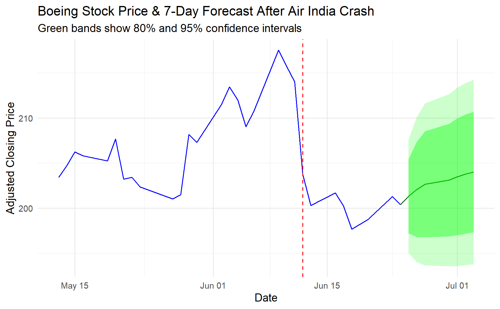

# Boeing Stock Forecast After Air India Engine Failure (June 2025)

This project analyzes Boeing’s stock price movement surrounding the Air India Boeing 787 engine failure on June 12, 2025. Using ARIMA time series forecasting in R, it predicts short-term stock price trends and visualizes the event's impact.

## 🚀 Project Goals
- Collect Boeing stock price data 30 days before and after the crash  
- Apply ARIMA modeling to forecast the next 7 trading days  
- Visualize price trends and forecast with confidence intervals  
- Highlight the crash date for contextual analysis  

## 🛠 Tools & Libraries
- R programming language  
- `quantmod` for financial data retrieval  
- `forecast` for ARIMA modeling  
- `ggplot2` and `tidyverse` for visualization  
- `lubridate` for date handling  

## 📈 Visualizations
  
*Stock price with forecast and crash date marked.*

## 🔍 Key Insights
The analysis shows how Boeing’s stock price reacted to the Air India crash, with a short-term dip followed by normalization within days. The ARIMA forecast provides an estimate of the expected price movement in the following week.

## 📂 How to Run
1. Open `Boeing_ARIMA_Forecast.R` in R or RStudio.  
2. Ensure required packages are installed (`quantmod`, `forecast`, `ggplot2`, etc.).  
3. Run the script to fetch data, generate forecasts, and produce plots.

## ⚖️ License
This project is licensed under the MIT License.

---

*Feel free to explore the code, adapt it, or reach out if you have questions!*
